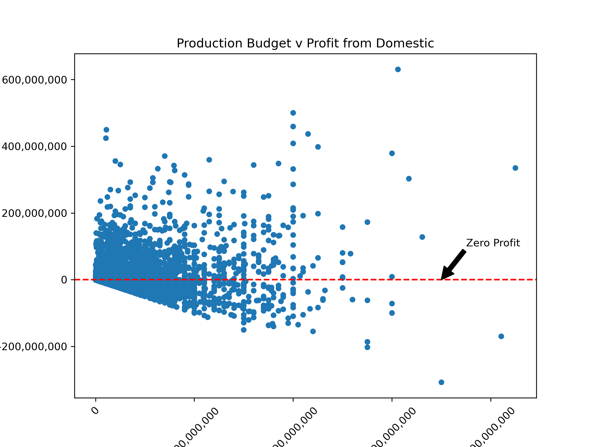
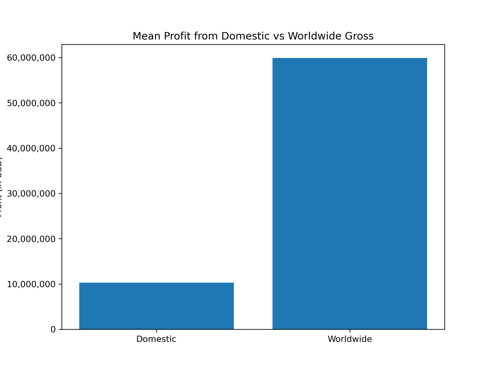
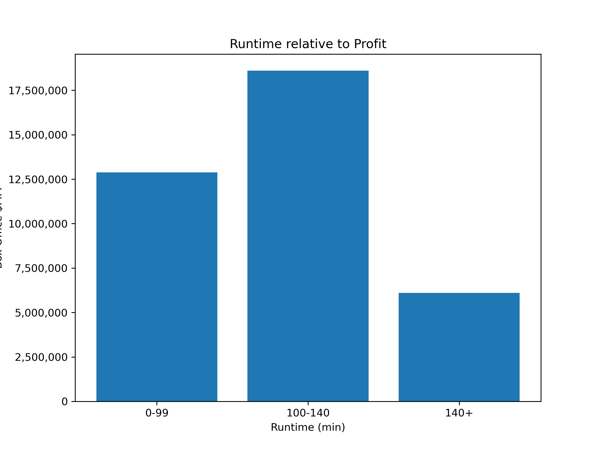

# Project Title
Analysis of box office perfomance for movies
## Overview
For this project, I am using exploratory data analysis to generate insights from different sources and past movies data for a business stakeholder.
## Business Understanding
The Company sees all the big companies creating original video content, and they want to get in on the fun. They have decided to create a new movie studio, but the problem is they don’t know anything about creating movies. They have hired me to help them better understand the movie industry. My team is charged with exploring what type of films are currently doing the best at the box office. We must then translate those findings into actionable insights that the head of Company's new movie studio can use to help decide what type of films to create.

## Data Understanding and Analysis

To answer the business questions, I've utilized various datasets including the IMBD Database,which is one of the biggest and detailed database on movie data and then selected the following that have relevant factors such as ratings and genres of past movies to guide our insights and recommendations. We also used TheNumbers for profit analysis and Rotten Tomatoes datasets for movie runtimes.

We believe that the "success" of a film can be measured by the revenue that it brings in and some big variables that affect the success of a film's directors, the film's market, and the film's budget.
## Results
 ## ecommendation 1

 ## Recommendation 2

 ## Recommendation 3
<

 ## Conclusion and Recommendations
Based on the information in the data sets, we can see the highest rated genres are Documentary, Biography, Adventure, Drama, Crime, Comedy, Action, Thriller and Horror. We recommend venturing into those fields as we explore what types of movies to make at Microsof's new studio.

In order to breakout into the movie scene by creating a new movie studio, the Company must expand into foreign markets as well as there is a better profit margin in international markets than just domestically in the United States.There is about a $50 million dollar difference in mean profit between international movies than just domestic movies alone.On top of that, the highest grossing movies with the most profit are franchise movies such as "Marvel Studios", "The Fast & The Furious Saga", "The Star Wars Saga", & "The Harry Potter Movies". It is imperative for the Company to start a movie studio based on a franchise that movie fans can really get behind.

Based on the above analysis the movies that have made the most profit are not very long nor are they very short. Most successfull movies at box office have runtime between 100-140 minutes.